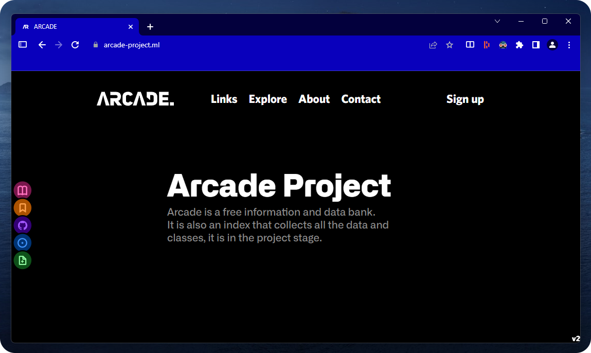

>Arcade is a free online database that aims to collect and index information available on the Web. Arcade is currently under development. And aims to become a reference tool.
As a project in development, Arcade is constantly being enriched with new data and new features. If you are looking for a reliable and comprehensive source of information, please give it a chance and explore its different sections.
