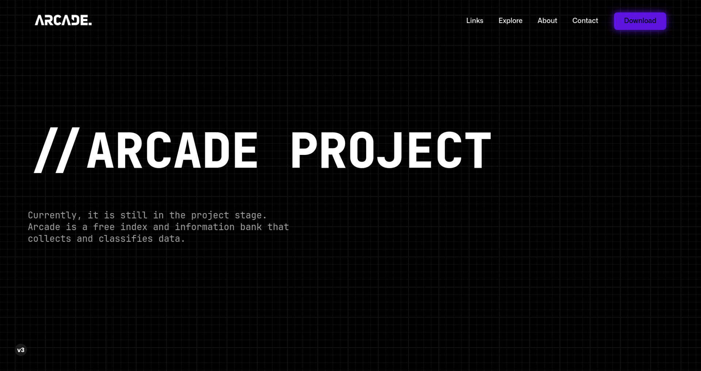

# // ARCADE PROJECT

 

> Arcade is a database and index under development that brings together all kinds of information and data from different sources. It is a free platform that offers easy and structured access to a large amount of data. Arcade's goal is to become a data reference and provide users with easy access to the information they are looking for. It is still in the project phase, but it promises to be a valuable tool for those seeking quality information. Arcade can be used in different circumstances depending on the data and information it collects. If you are interested in learning more about Arcade, please contact us.
